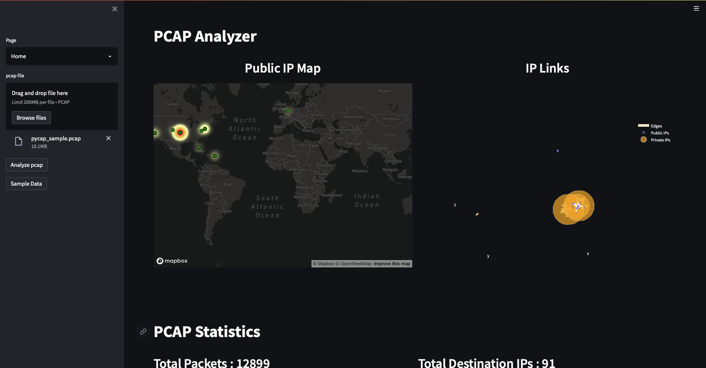
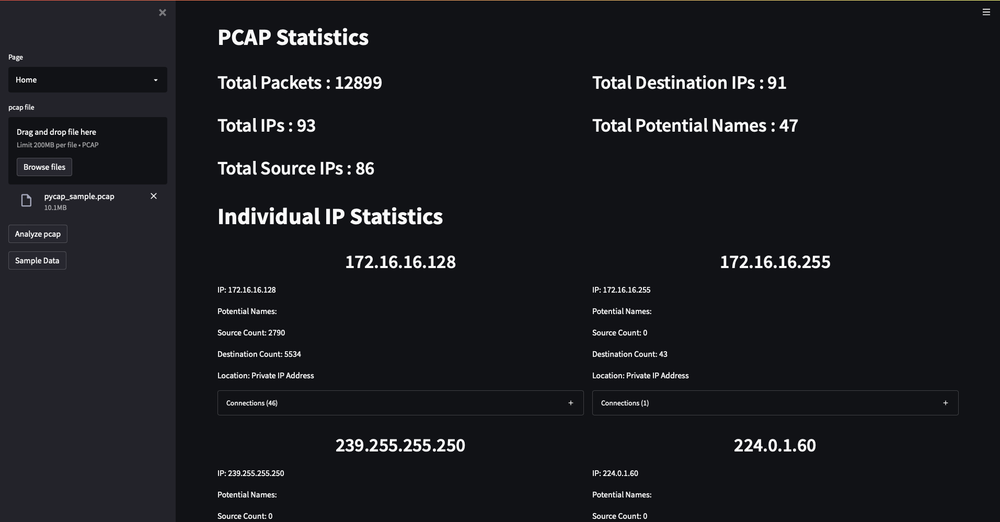
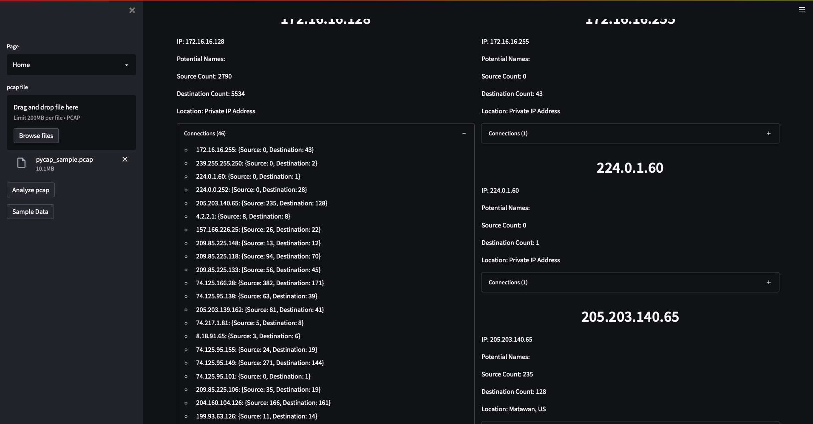
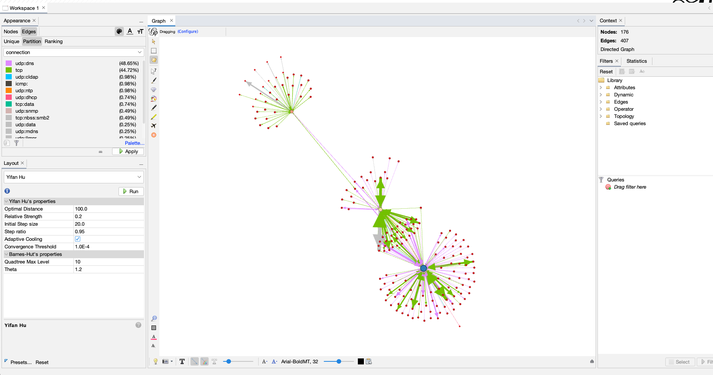

# PyCap

PCAP analyzer tool.

## Main Page

## Interactive 3D Network Map

## Gephi Output Example

To install all dependencies needed:

$ pip install -r requirements.txt

# To run GUI import the following code:
$ streamlit run pycap_gui.py

# To run the code input the following:

$ python3 pycap.py (add flags)

# Commands 
* -g  -gephi      analyzes pcap and exports file for gephi
* -O  -outfile    declares the filename
* -p  -pcap       identifies the pcap file
* -s  -stats      prints statistical data from the pcap